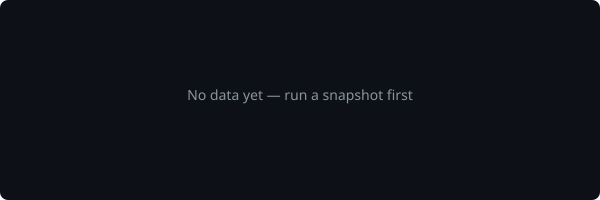

# GitHub Follower Tracker

Track your GitHub follower growth with **daily snapshots**, an **interactive dashboard**, and **embeddable widgets**.



---

## Features

| Feature | Description |
|---------|-------------|
| 📸 **Daily Snapshots** | Record your follower count daily; automatically detect new and lost followers |
| 📊 **Interactive Dashboard** | Web-based dashboard with 7-day, 30-day, and all-time growth charts |
| 🖼️ **Embeddable Widgets** | Generate SVG charts you can embed directly in your README or personal site |
| 💾 **Local Data Store** | All data cached client-side in a JSON file — no external database required |

## Prerequisites

- [Node.js](https://nodejs.org/) v18+
- [GitHub CLI (`gh`)](https://cli.github.com/) — installed and authenticated

```bash
# Verify gh is set up
gh auth status
```

## Installation

```bash
git clone https://github.com/your-username/github-follower-tracker.git
cd github-follower-tracker
npm install
```

## Usage

### 📸 Take a Snapshot

Save today's follower count and detect who followed / unfollowed you:

```bash
npm run snapshot
# or
node bin/tracker.js snapshot
```

Example output:

```
📸 Taking follower snapshot...

  User:      octocat
  Date:      2026-08-30
  Followers: 152

  ✅ New followers (2):
     + new-friend
     + another-dev

  ❌ Lost followers (1):
     - old-acquaintance

✅ Snapshot saved successfully.
```

### 📊 View History (Terminal)

```bash
# All time
npm run history

# Last 7 days
node bin/tracker.js history --days 7
```

### 🚀 Launch Dashboard

Start the interactive web dashboard with growth charts:

```bash
npm run dashboard

# Custom port
node bin/tracker.js dashboard --port 8080
```

Opens `http://localhost:3000` with:
- Follower count stats cards
- Interactive Chart.js growth chart (7d / 30d / all-time)
- Recently gained & lost followers
- Daily log table

### 🖼️ Generate Widget

Create an embeddable SVG chart for your README:

```bash
npm run widget

# Custom options
node bin/tracker.js widget --days 90 --width 800 --height 250
```

Embed in your README:

```markdown

```

Or in HTML:

```html

```

## Project Structure

```
github-follower-tracker/
├── bin/
│   └── tracker.js              # CLI entry point
├── src/
│   ├── lib/
│   │   ├── store.js            # JSON file data store
│   │   └── github.js           # GitHub API via gh CLI
│   ├── commands/
│   │   ├── snapshot.js         # Take daily snapshot
│   │   ├── history.js          # Terminal history view
│   │   ├── dashboard.js        # Launch web dashboard
│   │   └── widget.js           # Generate SVG widget
│   └── server/
│       ├── index.js            # Express API server
│       └── public/             # Dashboard frontend
│           ├── index.html
│           ├── css/dashboard.css
│           └── js/dashboard.js
├── data/                       # Snapshot store (gitignored)
├── widgets/                    # Generated widgets
├── package.json
└── .gitignore
```

## Automating Daily Snapshots

### Windows (Task Scheduler)

```powershell
# Create a daily task at 9 AM
schtasks /create /tn "GitHubFollowerSnapshot" /tr "node C:\path\to\bin\tracker.js snapshot" /sc daily /st 09:00
```

### macOS / Linux (cron)

```bash
# Edit crontab
crontab -e

# Add this line to run daily at 9 AM
0 9 * * * cd /path/to/github-follower-tracker && node bin/tracker.js snapshot
```

## License

MIT
